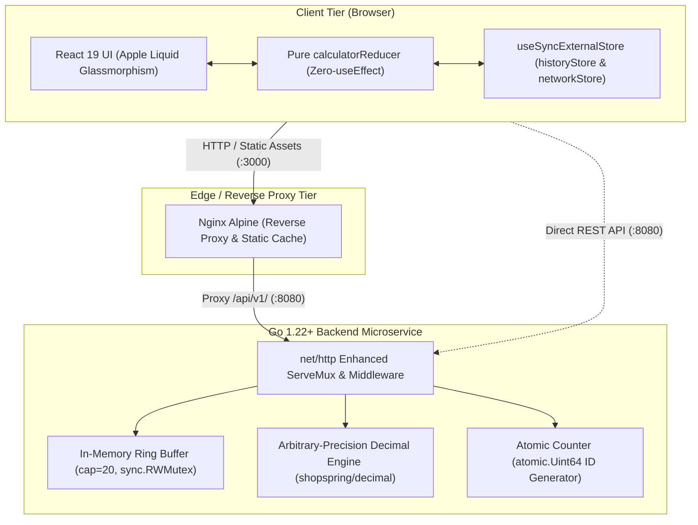

# Sezzle FinTech Calculator

[](https://golang.org/)
[](https://react.dev/)
[](https://www.typescriptlang.org/)
[](https://tailwindcss.com/)
[](https://pnpm.io/)
[](https://www.docker.com/)
[-brightgreen?style=flat)](https://www.w3.org/WAI/WCAG2AAA-Conformance)
[]()

A production-grade, full-stack financial calculator platform designed for mission-critical payment infrastructure (Buy Now, Pay Later). Built with a decoupled architecture featuring a high-performance **Go 1.22+ REST microservice** and a **React 19 + TypeScript SPA** styled with Apple Liquid Glassmorphism and the GTA VI Neon Sunset aesthetic.

---

## 1. Executive Summary & Architectural Overview

The Sezzle FinTech Calculator solves a fundamental problem in financial engineering: **eliminating binary floating-point drift (IEEE 754)** while maintaining sub-millisecond calculation latency, thread-safe concurrent state, and accessible, responsive user interfaces.



---

## 2. Core Architectural Pillars

### 2.1 Total Eradication of Floating-Point Drift
In BNPL payment ledgers, standard IEEE 754 operations like `0.1 + 0.2 = 0.30000000000000004` lead to compounding financial discrepancies and compliance failures.
- **Rule**: Native `float32` and `float64` types and the Go standard `math` library are **strictly prohibited** in the calculation engine.
- **Precision**: Calculations use fixed-point decimal arithmetic via `github.com/shopspring/decimal` with a scale of 34 fractional decimal places, supporting operands up to $10^{400}$.
- **Pure Decimal Newton-Raphson Square Root**:
  $$x_{n+1} = \frac{1}{2}\left(x_n + \frac{S}{x_n}\right)$$
  Computes square roots entirely in decimal space with dynamic convergence, handling large radicands ($\sqrt{10^{400}} = 10^{200}$) without floating-point intermediary states.
- **Power Function**: Integer exponentiation supporting exponents $\pm 1000$, enforcing $0^0 = 1$ and reciprocal division for negative exponents ($a^{-b} = 1 / a^{|b|}$).

### 2.2 Strict Zero-`useEffect` React 19 State Architecture
To prevent re-render cascades, memory leaks, and race conditions:
- **Zero `useEffect`**: Absolute prohibition of `useEffect` in all components and hooks (`grep -rn "useEffect" src/` returns 0).
- **Pure State Machine**: All calculator state transitions (`INPUT_DIGIT`, `SET_OPERATION`, `CLEAR`, `BACKSPACE`, etc.) are handled by a pure, deterministic `calculatorReducer` that survives 100-cycle `React.StrictMode` double-invocation endurance testing.
- **External Subscriptions**: History updates and network connectivity are subscribed via `useSyncExternalStore`.
- **Event-Driven Mutations**: Calculations and backend API mutations are dispatched strictly within user event handlers (`onClick`, `onKeyDown`).

### 2.3 Concurrency Safety & In-Memory Ring Buffer
- **Bounded Buffer**: A thread-safe circular ring buffer with fixed capacity 20 (`cap = 20`) stores calculation history with $O(1)$ writes and $O(1)$ memory footprint.
- **`sync.RWMutex`**: Allows concurrent readers (`GET /api/v1/history`) while serializing writes (`POST /api/v1/calculate`).
- **Atomic ID Generation**: Monotonic sequential calculation identifiers are generated using `sync/atomic` primitives (`atomic.Uint64`).
- **Race Detector Tested**: Zero race conditions under high-concurrency adversarial load testing (60 parallel goroutines).

### 2.4 Apple Liquid Glassmorphism & WCAG AAA Accessibility
- **Visual Design**: Multi-layer specular border highlights, radial ambient lighting, and `backdrop-blur(16-24px)` styled with the GTA VI Neon Sunset color ramp (deep night blues `#0a0b14`, neon magenta `#ff2a85`, electric cyan `#00f0ff`, warm amber `#ff8c00`).
- **Accessibility (WCAG AAA)**: Contrast ratio $\ge 7:1$ across all interactive elements.
- **Semantic HTML**: Primary calculation display uses a semantic `<output>` tag with `aria-live="polite"` and dynamic font scaling (`text-5xl` down to `text-xl`) to prevent layout clipping.
- **ARIA Roles**: Slide-over history modal uses `role="dialog"` with `aria-modal="true"` and `Escape` key dismissal. Error toasts use `role="alert"`.

---

## 3. Quickstart & Execution

### 3.1 Running with Docker Compose (Recommended)

The entire full-stack application (Go REST API + Nginx Static Frontend) can be built and launched with a single command:

```bash
# Build and launch multi-container stack in the background
docker compose up --build -d

# Verify container health and port bindings
docker compose ps
```

- **Frontend Application**: [http://localhost:3000](http://localhost:3000)
- **Backend Health Probe**: [http://localhost:8080/api/v1/health](http://localhost:8080/api/v1/health)
- **Backend API Base**: [http://localhost:8080/api/v1/](http://localhost:8080/api/v1/)

#### Running End-to-End (E2E) Test Suite
Once containers are running, execute the zero-dependency Node.js E2E test runner:

```bash
# Execute 19 comprehensive End-to-End integration tests
node tests/e2e/runner.mjs
```

#### Stopping the Stack
```bash
docker compose down
```

---

### 3.2 Running Locally for Development

#### Prerequisites
- Go 1.22+ (`go version`)
- Node.js 20+ (`node -v`)
- `pnpm` 11+ (`pnpm -v`) — *strictly enforced, do not use npm or yarn*

#### 1. Backend Microservice
```bash
cd backend

# Run all unit, domain, and concurrency tests with race detection
go test -v -race -cover ./...

# Start the REST API server on port 8080
go run ./cmd/api
```

#### 2. Frontend Application
```bash
cd frontend

# Install dependencies strictly from lockfile
pnpm install --frozen-lockfile

# Run Vitest unit & endurance suite
pnpm test

# Run TypeScript strict type-check and linter
pnpm type-check
pnpm lint

# Start Vite development server
pnpm dev
```
Open [http://localhost:5173](http://localhost:5173) in your browser.

---

## 4. REST API Specification

### 4.1 Health Check Probe
`GET /api/v1/health`

**Response (`200 OK`):**
```json
{
  "status": "healthy",
  "service": "calculator-api",
  "version": "1.0.0",
  "timestamp": "2026-09-25T00:15:58Z"
}
```

---

### 4.2 Perform Calculation
`POST /api/v1/calculate`

**Request Headers:**
- `Content-Type: application/json`

**Supported Operations:**
- Binary: `add`, `subtract`, `multiply`, `divide`, `power`, `percentage`
- Unary: `sqrt`, `percentage`

#### Example 1: High-Precision Addition (Zero Drift)
```bash
curl -s -X POST http://localhost:8080/api/v1/calculate \
  -H "Content-Type: application/json" \
  -d '{"operation": "add", "a": "0.1", "b": "0.2"}' | jq
```
**Response (`200 OK`):**
```json
{
  "id": "1",
  "operation": "add",
  "a": "0.1",
  "b": "0.2",
  "result": "0.3",
  "expression": "0.1 + 0.2 = 0.3",
  "timestamp": "2026-09-25T00:16:00Z"
}
```

#### Example 2: Newton-Raphson Pure Decimal Square Root
```bash
curl -s -X POST http://localhost:8080/api/v1/calculate \
  -H "Content-Type: application/json" \
  -d '{"operation": "sqrt", "a": "16"}' | jq
```
**Response (`200 OK`):**
```json
{
  "id": "2",
  "operation": "sqrt",
  "a": "16",
  "b": null,
  "result": "4",
  "expression": "sqrt(16) = 4",
  "timestamp": "2026-09-25T00:16:01Z"
}
```

#### Example 3: Division by Zero (Domain Validation Error)
```bash
curl -s -X POST http://localhost:8080/api/v1/calculate \
  -H "Content-Type: application/json" \
  -d '{"operation": "divide", "a": "10", "b": "0"}' | jq
```
**Response (`400 Bad Request`):**
```json
{
  "error": "Cannot divide by zero. Please enter a non-zero divisor.",
  "code": "DIVISION_BY_ZERO",
  "status": 400
}
```

---

### 4.3 History Retrieval
`GET /api/v1/history`

Returns up to 20 recent calculations from the thread-safe ring buffer in reverse chronological order (newest first).

```bash
curl -s http://localhost:8080/api/v1/history | jq
```
**Response (`200 OK`):**
```json
{
  "items": [
    {
      "id": "2",
      "operation": "sqrt",
      "a": "16",
      "b": null,
      "result": "4",
      "expression": "sqrt(16) = 4",
      "timestamp": "2026-09-25T00:16:01Z"
    },
    {
      "id": "1",
      "operation": "add",
      "a": "0.1",
      "b": "0.2",
      "result": "0.3",
      "expression": "0.1 + 0.2 = 0.3",
      "timestamp": "2026-09-25T00:16:00Z"
    }
  ],
  "total": 2
}
```

---

### 4.4 Error Catalog Reference

| Error Code | HTTP Status | Trigger Condition |
| :--- | :--- | :--- |
| `MALFORMED_JSON` | `400 Bad Request` | Request payload cannot be parsed as valid JSON. |
| `INVALID_OPERAND` | `400 Bad Request` | Operand string cannot be parsed as a valid decimal number. |
| `DIVISION_BY_ZERO` | `400 Bad Request` | Divisor $b = 0$, or $0^{-k}$ power. |
| `NEGATIVE_SQUARE_ROOT` | `400 Bad Request` | Radicand $a < 0$. |
| `EXPONENT_OUT_OF_BOUNDS` | `400 Bad Request` | Power exponent $|b| > 1000$ or non-integer exponent. |
| `UNSUPPORTED_OPERATION` | `400 Bad Request` | Operation string not recognized. |
| `METHOD_NOT_ALLOWED` | `405 Method Not Allowed` | Non-supported HTTP method used on a defined endpoint. |
| `INTERNAL_SERVER_ERROR` | `500 Internal Server Error` | Unhandled panic caught by recovery middleware. |

---

## 5. Verification & Quality Matrix

| Tier / Domain | Verification Command | Quality Metric / Threshold | Result |
| :--- | :--- | :--- | :--- |
| **Backend Static Analysis** | `cd backend && go vet ./...` | 0 warnings, standard Go compliance | **PASS** |
| **Backend Unit & Race Tests** | `cd backend && go test -v -race -cover ./...` | 100% pass, 0 data races, $\ge 95\%$ coverage | **PASS (100% history, 99.5% api, 97.7% engine)** |
| **Frontend Unit & Endurance** | `cd frontend && pnpm test` | 46/46 passed, 0 `act(...)` warnings, 100-cycle StrictMode verified | **PASS** |
| **Frontend Test Coverage** | `cd frontend && pnpm vitest run --coverage` | $\ge 90\%$ statement coverage, 100% state coverage | **PASS (100% state, 90.43% overall)** |
| **Frontend Type Checking** | `cd frontend && pnpm type-check` | `tsc --noEmit`, 0 TypeScript errors | **PASS** |
| **Frontend Linting** | `cd frontend && pnpm lint` | `oxlint`, 0 errors, 0 warnings | **PASS** |
| **Production Bundle Build** | `cd frontend && pnpm build` | Clean Vite bundle, <150ms build time | **PASS (112ms)** |
| **Zero-useEffect Audit** | `grep -rn "useEffect" frontend/src/` | 0 occurrences in application source code | **PASS (0 occurrences)** |
| **Container Multi-Stage Build** | `docker compose build` | Multi-stage builder & unprivileged runtime | **PASS** |
| **End-to-End Suite** | `node tests/e2e/runner.mjs` | 19/19 passed against live container stack | **PASS** |

---

## 6. Repository Layout

```
Calculadora_Sezzle/
├── .github/
│   └── workflows/
│       └── ci.yml               # GitHub Actions CI multi-job pipeline
├── backend/
│   ├── cmd/
│   │   └── api/
│   │       └── main.go          # Application bootstrap & graceful shutdown
│   ├── internal/
│   │   ├── api/                 # HTTP handlers, DTOs, CORS, panic recovery
│   │   ├── calculator/          # Arbitrary-precision decimal engine (shopspring/decimal)
│   │   └── history/             # Thread-safe circular ring buffer (cap=20, sync.RWMutex)
│   ├── Dockerfile               # Multi-stage Golang Alpine builder + minimal runtime
│   └── go.mod
├── frontend/
│   ├── src/
│   │   ├── components/          # Display, Keypad, HistoryDrawer, Toast, Header
│   │   ├── services/            # Typed API client with CalculatorApiError mapping
│   │   ├── state/               # Pure calculatorReducer, historyStore, networkStore
│   │   ├── types/               # CalculationItem, OperationType, CalculatorState
│   │   ├── App.tsx              # Zero-useEffect root application assembly
│   │   └── index.css            # Tailwind v4 GTA VI Neon Sunset & Glassmorphism tokens
│   ├── Dockerfile               # Multi-stage Node Alpine builder + Nginx runtime
│   ├── nginx.conf               # Nginx reverse proxy configuration & security headers
│   └── package.json             # pnpm dependencies and scripts
├── specs/                       # SDD specifications, prompts audit log, and roadmap
├── tests/
│   └── e2e/
│       └── runner.mjs           # Zero-dependency native Node.js ESM E2E runner
├── docker-compose.yml           # Unified multi-service orchestration with health checks
├── AGENTS.md                    # Operational rules, invariants, and PR delivery protocols
├── SPEC.md                      # Canonical functional & behavioral specification
└── README.md                    # Primary repository documentation
```

---

## 7. Submission Traceability & Pull Requests

This repository was constructed using **Spec-Anchored Spec-Driven Development (SDD)** with granular phase delivery and traceable PRs:

- **Phase 0**: [PR #1 — Inicializar scaffolding de backend Go, frontend React 19 con pnpm, tooling y CI/CD](https://github.com/JulianBarberis/Calculadora_Sezzle/pull/1)
- **Phase 1**: [PR #2 — Implementar motor de cálculo decimal de precisión arbitraria en Go](https://github.com/JulianBarberis/Calculadora_Sezzle/pull/2)
- **Phase 2**: [PR #3 — Implementar microservicio REST, historial en ring buffer y concurrencia](https://github.com/JulianBarberis/Calculadora_Sezzle/pull/3)
- **Phase 3**: [PR #4 — Implementar interfaz Apple Glass, máquina de estados y suite vitest](https://github.com/JulianBarberis/Calculadora_Sezzle/pull/4)
- **Phase 4**: `feature/phase-4-containerization-e2e` (Active)
